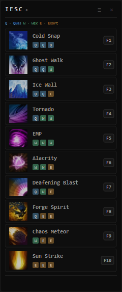
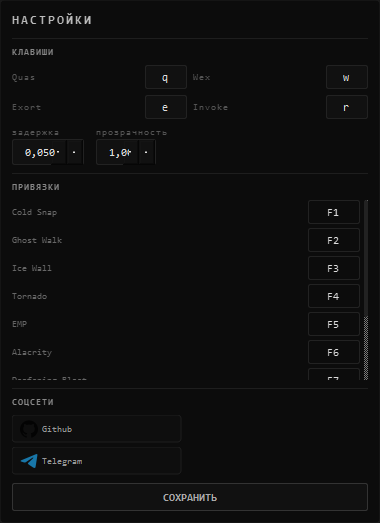

# ⚡ InvokerEasySpellsCaster (IESC)

[](https://www.python.org/)
[](https://www.riverbankcomputing.com/software/pyqt/)
[](LICENSE)
[](https://github.com/MakeHimCake/InvokerEasySpellsCaster/releases/tag/release)

<p align="center">
  <strong>Макрос, упрощающий применение заклинаний в Dota 2</strong><br>
  <em>Быстрый каст заклинаний, настраиваемые хоткеи</em>
</p>

---

## 📖 Оглавление

- [О проекте](#-о-проекте)
- [Возможности](#-возможности)
- [Галерея](#-галерея)
- [Установка](#-установка)

---

## 🎯 О проекте

**IESC** — это легковесное desktop-приложение, созданное для игроков в Dota 2, которые хотят улучшить свою игру на Invoker. Приложение предоставляет удобный интерфейс для быстрого вызова комбинаций заклинаний с настраиваемыми горячими клавишами.

### Почему IESC?

- ⚡ **Мгновенный каст** — автоматизация комбинаций орбов
- ⚙️ **Полная кастомизация** — настройте под свой стиль игры

---

## ✨ Возможности

### 🔥 Основные функции

- **10 заклинаний Invoker** — все комбинации орбов в одном окне
- **Автоматический каст** — нажмите одну кнопку для полной комбинации
- **Гибкая настройка клавиш** — измените клавиши для Quas (Q), Wex (W), Exort (E) и Invoke (R)
- **Персональные бинды** — назначьте удобные клавиши для каждого заклинания (F1-F10 по умолчанию)
- **Визуальная обратная связь** — анимация последнего использованного заклинания
- **Регулировка задержки** — настройте скорость нажатия клавиш (0.01-0.3 сек)
- **Прозрачность окна** — адаптируйте под ваш монитор (30-100%)

---

## 📸 Галерея

### Основной интерфейс

<p align="center">
  
  <br><em>Основное окно приложения со списком заклинаний</em>
</p>

### Настройки

<p align="center">
  
  <br><em>Гибкая настройка клавиш и параметров</em>
</p>

---

## 📦 Установка

### Требования для компиляции

- **Python 3.8** или выше
- **pip** (менеджер пакетов Python)

### Шаг 1: Клонирование репозитория

```bash
git clone https://github.com/MakeHimCake/InvokerEasySpellsCaster.git
cd invoker-helper
